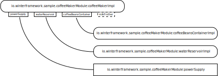

[inversion-of-control]: https://en.wikipedia.org/wiki/Inversion_of_control
[dependency-injection]: https://en.wikipedia.org/wiki/Dependency_injection
[object-oriented-programming]: https://en.wikipedia.org/wiki/Object-oriented_programming
[separation-of-concerns]: https://en.wikipedia.org/wiki/Separation_of_concerns

[gradle]: https://gradle.org/

# Inverno Core

## Motivation

[Inversion of Control][inversion-of-control] and [Dependency Injection][dependency-injection] principles are not new and many Java applications have been developed following these principles over the past two decades using frameworks such as Spring, CDI, Guice... However these recognized solutions might have some issues in practice especially with the way Java has evolved and how applications should be developed nowadays.

Dependency injection errors like a missing dependency or a cycle in the dependency graph are often reported at runtime when the application is started. Most of the time these issues are easy to fix but when considering big applications split into multiple modules developed by different people, it might become more complex. In any case you can't tell for sure if an application will start before you actually start it.

Most IoC/DI frameworks are black boxes, often considered as magical because one gets beans instantiated and wired altogether without understanding what just happened and it is indeed quite hard to figure out how it actually works. This is not a problem as long as everything works as expected but it can become one when you actually need to troubleshoot a failing application.

Beans instantiation and wiring are done at runtime using Java reflection which offers all the advantages of Java dynamic linking at the expense of some performance overhead. Classpath scanning, instantiation and wiring process indeed takes some time and prevents just-in-time compilation optimization making application startup quite slow.

Although IoC frameworks make the development of modular applications easier, they often require a rigorous methodology to make it the right way. For instance, you must know precisely what components are provided and/or required by all the modules composing an application and make sure one doesn't provide a component that might interfere with another.

These points are very high level, please have a look at this [article](https://inverno.medium.com/reviving-java-ioc-di-and-why-does-it-matters-b1a2b0b57cca) if you like to learn more about the general ideas behind the Inverno framework. The Inverno framework proposes a new approach of IoC/DI principles consistent with latest developments of the Java™ platform and perfectly adapted to the development of modern applications in Java.   

## Prerequisites

In this documentation, we’ll assume that you have a working knowledge of [Inversion of Control][inversion-of-control] and [Dependency Injection][dependency-injection] principles as well as [Object Oriented Programming][object-oriented-programming].

## Overview

The Inverno framework is different in many ways and tries to address previous issues. Its main difference is that it doesn't rely on Java reflection at all to instantiate the beans composing an application (IoC) and wire them together (DI), this is actually done by a class generated by the Inverno compiler at compile time.

Since beans and their dependencies are determined at compile time, errors can be raised precisely when they make sense during development or at build time.

There is also no need for complex runtime libraries since the complexity is handled by the compiler which generates a readable class providing only what is required at runtime. This presents two advantages, first applications have a small footprint and start fast since most of the processing is already done and no reflection is involved. Secondly you will be able to actually debug all parts of your application since nothing is hidden behind a complex library, you can actually see when the beans are instantiated with the `new` operator opening rooms to other compile and runtime optimization as well.

The framework also fully embraces the modular system introduced in Java 9 which basically imposes to develop with modularity in mind. An Inverno module only exposes the beans that must be exposed to other modules and it clearly indicates the beans it requires to operate. All this makes modular development safer, clearer and more natural.

### Modules and Beans

Inversion of control and dependency injection principles have proven to be an elegant and efficient way to create applications in an Object Oriented Programming language. A Java application basically consists in a set of interconnected objects.

An Inverno application adds a modular dimension to these principles, the objects or the **beans** composing the application are created and connected in one or more isolated **modules** which are themselves composed in the **application**.

A **module** encapsulates several beans and possibly other modules. It specifies the dependencies it needs to operate and only exposes the beans that need to be exposed from the module perspective. As a result it is isolated from the rest of the application, it is unaware of how and where it is used and it actually doesn't care as long as its requirements are met. It really resembles a class which makes it very familiar to use.

A **bean** is a component of a module and more widely an application. It has required and optional dependencies provided by the module when a bean instance is created.

The **Inverno compiler** is an annotation processor which runs inside the Java compiler and generates module classes based on Inverno annotations found on the modules and classes being compiled.

### Java module system

Before you can create your first Inverno module, you must first understand what a Java module is and how it might change your life as a Java developer. If you are already familiar with it, you can skip that section and go directly to the [project setup](#project-setup) section.

The Java module system has been introduced in Java 9 mostly to modularize the overgrowing Java runtime library which is now split into multiple interdependent modules loaded when you need them at runtime or compile time. This basically means that the size of the Java runtime you need to compile and/or run your application now depends on your application's needs which is a pretty big improvement.

If you know OSGI or Maven already, you might say that modules have existed in Java for a long time but now they are fully integrated into the language, the compiler and the runtime. You can create a Java module, specify what packages are exposed and what dependencies are required and the good part is that both the compiler and JVM tell you when you do something wrong being as close as possible to the code, there’s no more xml or manifest files to care about.

So how do you create a Java module? There is plenty of documentation you can read to have a complete and deep understanding of the Java module system, here we will only explain what you need to know to develop regular Inverno modules.

A Java module is specified in a `module-info.java` file located in the default package. Let's assume you want to create module `io.inverno.example.sample`, you can create the following file structure:

```plaintext
src
└── io.inverno.example.sample
    ├── io
    │   └── inverno
    │       └── example
    │           └── sample
    │               ├── internal
    │               │   └── ...
    │               └── ...
    └── module-info.java
```

> This is one way to organize the code, the only important thing is to put the `module-info.java` descriptor in the default package.

Now let's have a closer look at the module descriptor:

```java
module io.inverno.example.sample {      // 1
    exports io.inverno.example.sample;  // 2
}
```

1. A module is declared using a familiar syntax starting with the `module` keyword followed by the name of the module which must be a valid Java name.
2. The `io.inverno.example.sample` module exports the `io.inverno.example.sample` package which means that other modules can only access public types contained in that package. Any type defined in another package within that module is only visible from within the module following usual Java visibility rules (default, public, protected, private). This basically defines a new level of encapsulation at module level. For instance, types in package `io.inverno.example.sample.internal` are not accessible to other modules regardless of their visibility.

Now let's say you need to use some external types defined and exported in another module `io.inverno.example.other`:

```plaintext
src
├── io.inverno.example.sample
│   ├── ...
│   └── module-info.java
└── io.inverno.example.other
    ├── ...
    └── module-info.java
```

If you try to reference any of these types in `io.inverno.example.sample` module as is the compiler will complain with explicit visibility errors unless you specify that `io.inverno.example.sample` module requires `io.inverno.example.other` module:

```java
module io.inverno.example.sample {
    requires io.inverno.example.other;
    
    exports io.inverno.example.sample;
}
```

You should now be able to reference any public types defined in a package exported in `io.inverno.example.other` module.  

The modular system has also changed the way Java applications are built and run. Before we used to specify a classpath listing the locations where the Java compiler and the JVM should look for application's classes whereas now we should specify a module path listing the locations of modules and forget about the classpath.

If we consider previous modules, they are compiled and run as follows:

```plaintext
> javac --module-source-path src -d jmods --module io.inverno.example.sample --module io.inverno.example.other

> java --module-path jmods/ --module io.inverno.example.sample/io.inverno.example.sample.Sample
```

There are other subtleties like transitive dependencies, service providers or opened modules and cool features like jmod packaging and the `jlink` tool but for now that's pretty much all you need to know to develop Inverno modules which are basically instrumented Java modules.

You should now have a basic understanding of how an Inverno application is built and what Java technologies are involved. An Inverno application results from the composition of multiple isolated modules which create and wire the beans making up the application. Almost everything is done at compile time where module classes are generated.

## Project Setup

### Maven

The easiest way to setup an Inverno module project is to start by creating a regular Java Maven project which inherits from `io.inverno.dist:inverno-parent` project and depends on `io.inverno:inverno-core`:

```xml
<project xmlns="http://maven.apache.org/POM/4.0.0"
    xmlns:xsi="http://www.w3.org/2001/XMLSchema-instance"
    xsi:schemaLocation="http://maven.apache.org/POM/4.0.0 http://maven.apache.org/xsd/maven-4.0.0.xsd">
    <modelVersion>4.0.0</modelVersion>
    <parent>
        <groupId>io.inverno.dist</groupId>
        <artifactId>inverno-parent</artifactId>
        <version>${VERSION_INVERNO_DIST}</version>
    </parent>
    <groupId>io.inverno.example</groupId>
    <artifactId>sample</artifactId>
    <version>1.0.0-SNAPSHOT</version>

    ...
    <dependencies>
        ...
        <dependency>
            <groupId>io.inverno</groupId>
            <artifactId>inverno-core</artifactId>
        </dependency>
        ...
    </dependencies>
    ...
    
</project>
```

Then you have to add a module descriptor to make it a Java module project. An Inverno module requires `io.inverno.core` and `io.inverno.core.annotation` modules. If you want your module to be used in other modules it must also export the package where the module class is generated by the Inverno compiler which is the module name by default. Remember that an Inverno module is materialized in a regular Java class subject to the same rules as any other class in a Java module.

```java
module io.inverno.example.sample {
    requires io.inverno.core;
    requires io.inverno.core.annotation;
    
    exports io.inverno.example.sample;
}
```

If you do not want your project to inherit from `io.inverno.dist:inverno-parent` project, you'll have to explicitly specify compiler source and target version (>=9), dependencies version and configure the Maven compiler plugin to invoke the Inverno compiler.

```xml
<project xmlns="http://maven.apache.org/POM/4.0.0"
    xmlns:xsi="http://www.w3.org/2001/XMLSchema-instance"
    xsi:schemaLocation="http://maven.apache.org/POM/4.0.0 http://maven.apache.org/xsd/maven-4.0.0.xsd">
    <modelVersion>4.0.0</modelVersion>
    <groupId>io.inverno.example</groupId>
    <artifactId>sample</artifactId>
    <version>1.0.0-SNAPSHOT</version>
    
    <properties>
        <project.build.sourceEncoding>UTF-8</project.build.sourceEncoding>
        <maven.compiler.source>11</maven.compiler.source>
        <maven.compiler.target>11</maven.compiler.target>
        <version.inverno>${VERSION_INVERNO_CORE}</version.inverno>
        <version.inverno.dist>${VERSION_INVERNO_DIST}</version.inverno.dist>
    </properties>

    <dependencyManagement>
        <dependencies>
            <dependency>
                <groupId>io.inverno.dist</groupId>
                <artifactId>inverno-dependencies</artifactId>
                <version>${version.inverno.dist}</version>
                <type>pom</type>
                <scope>import</scope>
            </dependency>
        </dependencies>
    </dependencyManagement>

    <dependencies>
        <dependency>
            <groupId>io.inverno</groupId>
            <artifactId>inverno-core</artifactId>
        </dependency>
    </dependencies>
    
    <build>
        <plugins>
            ...
            <plugin>
                <artifactId>maven-compiler-plugin</artifactId>
                <configuration>
                    <annotationProcessorPaths>
                        <path>
                            <groupId>io.inverno</groupId>
                            <artifactId>inverno-core-compiler</artifactId>
                            <version>${version.inverno}</version>
                        </path>
                    </annotationProcessorPaths>
                </configuration>
            </plugin>
            ...
        <plugin>
    </build>
</project>
```

An Inverno module is built just as a regular Maven project using maven commands (compile, package, install...). The module class is generated and compiled during the `compile` phase and included in the resulting JAR file during the `package` phase. If anything related to IoC/DI goes wrong during compilation, the compilation fails with explicit compilation errors reported by the Inverno compiler.

### Gradle

Since version 6.4, it is also possible to use [Gradle][gradle] to build Inverno module projects. Here is a sample `build.gradle` file:

```java
plugins {
    id 'application'
}

repositories {
    mavenCentral()
}

dependencies {
    implementation 'io.inverno:inverno-core:${VERSION_INVERNO_CORE}'
    annotationProcessor 'io.inverno:inverno-core-compiler:${VERSION_INVERNO_CORE}'
}

java {
    modularity.inferModulePath = true
    sourceCompatibility = JavaVersion.VERSION_11
    targetCompatibility = JavaVersion.VERSION_11
}

application {
    mainModule = 'io.inverno.example.hello'
    mainClassName = 'io.inverno.example.hello.App'
}
```

## Bean

As you already know, a Java application can be reduced to the composition of objects working together. In an Inverno application, these objects are instantiated and injected into each other by one or more modules. Inside a module, a bean basically specifies what it needs to create a bean instance (DI) and how to obtain it (IoC).

A bean and a bean instance are two different things that should not be confused. A bean can result in multiple bean instances in the application whereas a bean instance always refers to exactly one bean. A bean is like a plan used to create instances.

A bean is fully identified by its name and the module in which it resides. The following notation is used to represent a bean qualified name: `[MODULE]:[BEAN]`. As a consequence, two beans with the same name cannot exist in the same module but it is safe to have multiple beans with the same name in different modules.

### Module Bean

Module bean is the primary type of beans you can create in an Inverno module. It is defined by a concrete class annotated with the `@Bean` annotation.

```java
import io.inverno.core.annotation.Bean;
    
@Bean
public class SomeBean {
    ...
}
```

In the previous code we created a bean of type `SomeBean`. At compile time, the Inverno compiler will include it in the generated module class that you'll eventually use at runtime to obtain `SomeBean` instances.

By default, a bean is named after the simple name of the class starting with a lower case (eg. `someBean` in our previous example). This can be specified in the annotation using the name attribute:

```java
@Bean(name="customSomeBean")
public class SomeBean {
    ...
}
```

### Wrapper Bean

A wrapper bean is a particular form of bean used to define beans whose code cannot be instrumented with Inverno annotations or that require more complex logic to create the instance. This is especially the case for legacy code or third party libraries.

A wrapper bean is defined by a concrete class annotated with both `@Bean` and `@Wrapper` annotations which basically wraps the actual bean instance and include the instantiation, initialization and destruction logic. It must implement the `Supplier<E>` interface which specifies the actual type of the bean as formal parameter.

```java
@Bean
@Wrapper
public class SomeWrapperBean implements Supplier<SomeLegacyBean> {
    
    private SomeLegacyBean instance;
    
    public SomeWrapperBean() {
        // Creates the wrapped instance 
        this.instance = ...
    }
    
    SomeLegacyBean get() {
        // Returns the wrapped instance
        return this.instance;
    }
    ...
}
```

In the previous code we created a bean of type `SomeLegacyBean`. One instance of the wrapper class is used to create exactly one bean instance and it lives as long as the bean instance is referenced.

Since a wrapper bean is annotated with `@Bean` annotation, it can be configured in the exact same way as a module bean except that it only applies to the wrapper instance which is responsible to configure the actual bean instance. The wrapper instance is never exposed, only the actual bean instance wrapped in it is exposed. As for module beans, `SomeLegacyBean` instances can be obtained using the generated Module class.

> Note that since a new wrapper instance is created every time a new bean instance is requested, a wrapper class is not required to return a new or distinct result in the `get()` method. Nonetheless a wrapper instance is used to create, initialize and destroy exactly one instance of the supplied type and as a result it is good practice to have the wrapper instance always return the same bean instance. This is especially true and done naturally when initialization or destruction methods are specified.

> When designing a prototype wrapper bean, particular care must be taken to make sure the wrapper does not hold a strong reference to the wrapped instance in order to prevent memory leak when a prototype bean instance is requested by the application. It is strongly advised to rely on `WeakReference<>` in that particular use case. 

### Nested Bean

A nested bean is, as its name suggests, a bean inside a bean. A nested bean instance is obtained by invoking a particular method on another bean instance. Instances thus obtained participate in dependency injection but unlike other types of bean they do not follow any particular lifecycle or strategy, the implementor of the nested bean method is free to decide whether a new instance should be returned on each invocation.

A nested bean is declared in the class of a bean, by annotating a non-void method with no arguments with `@NestedBean` annotation. The name of a nested bean is given by the name of the bean providing the instance and the name of the annotated method following this notation: `[MODULE]:[BEAN].[METHOD_NAME]`.

```java
@Bean
public class SomeBean {

    ...

    @NestedBean
    public SomeNestedBean nestedBean() {
        ...
    }
}
```

It is also possible to *cascade* nested beans.

### Overridable

A module bean or a wrapper bean can be declared as overridable which allows to override the bean inside the module by a socket bean of the same type.

An overridable bean is defined as a module bean or a wrapper bean whose class has been annotated with `@Overridable`. This basically tells the Inverno compiler to create an extra optional socket bean with the particular feature of being able to take over the bean when an instance is provided on module instantiation.

```java
@Bean
@Overridable
public class SomeBean {
    
}
```

### Lifecycle

All bean instances follow the subsequent lifecycle in a module:

1. A bean instance is created
2. It is initialized
3. It is active
4. It is *"eventually"* destroyed

Let's examine each of these steps in details.

A bean instance is always created in a module, when a bean instance is created greatly depends on the context in which it is used, it can be created when a module instance is started or when it is required in the application. In order to create a bean instance the module must provide all the dependencies required by the bean. After that it sets any optional dependencies available on the instance thus obtained. This is actually when and where dependency injection takes place, this aspect will be covered more in details in following sections, for now all you have to know is that when requested the module creates a fully wired bean instance.

After that the module invokes initialization methods on the bean instance to initialize it. An initialization method is declared on the bean class using the `@Init` annotation:

```java
@Bean
public class SomeBean {
    
    @Init
    public void init() {
        ...
    }
}
```

You can specify multiple initialization methods but the order in which they are invoked is undetermined. Inheritance is not considered here, only the methods annotated on the bean class are considered. Bean initialization is useful when you want to execute some code after dependency injection to make the bean instance fully functional (eg. initialize a connection pool, start a server socket...).

After that, the bean instance is active and can be used either directly by accessing it from the module or indirectly through another bean instance where it has been injected.

A bean instance is *"eventually"* destroyed, typically when its enclosing module instance is stopped. Just as you specified initialization methods, you can specify destruction methods to be invoked when a bean instance is destroyed using the `@Destroy` annotation:

```java
@Bean
public class SomeBean {
    
    @Destroy
    public void destroy() {
        ...
    }
}
```

As for initialization methods, you can specify multiple destruction methods but the order in which they are invoked is undetermined and inheritance is also not considered. Bean destruction is useful when you need to free resources that have been allocated by the bean instance during application operation (eg. shutdown a connection pool, close a server socket...).

In case of wrapper beans, the initialization and destruction of a bean instance is delegated to the initialization and destruction methods specified on the wrapper bean which respectively initialize and destroy the actual bean instance wrapped in the wrapper bean.

```java
@Bean
@Wrapper
public class SomeWrapperBean implements Supplier<SomeLegacyBean> {
    
    private SomeLegacyBean instance;
    
    public SomeWrapperBean() {
        // Creates the wrapped instance 
        this.instance = ...
    }
    
    @Init
    public void init() {
        // Initialize the wrapped instance
        this.instance.start();
    }
    
    @Destroy
    public void destroy() {
        // Destroy the wrapped instance
        this.instance.stop();
    }
    ...
}
```

> We stated here that all bean instances are eventually destroyed but this is actually not always the case. Depending on the bean strategy and the context in which it is used, it might not be destroyed at all, hopefully workarounds exist to make sure a bean instance is always properly destroyed. We'll cover this more in detail when we'll describe [bean strategies](#strategy).

### Visibility

A bean can be assigned a public or private visibility. A public bean is exposed by the module to the rest of the application whereas a private bean is only visible from within the module.

Bean visibility is set in the `@Bean` annotation in the visibility attribute:

```java
@Bean(visibility=Visibility.PUBLIC)
public class SomeBean {
    
}
```

### Strategy

A bean is always defined with a particular strategy which controls how a module should create a bean instance when one is requested, either during dependency injection when a module requires a bean instance to inject in another bean instance or during application operation when some application code requests a bean instance to a module instance.

#### Singleton

The singleton strategy is the default strategy used when no explicit strategy is specified on a bean class. An Inverno module only creates one single instance for a singleton bean. That same instance is returned every time an instance of that bean is requested. It is then shared among all dependent beans through dependency injection and also the application if it has requested an instance.

A singleton bean is specified explicitly by setting the `strategy` attribute to `Strategy.SINGLETON` in the `@Bean` annotation:

```java
@Bean(strategy = Strategy.SINGLETON)
public class SomeSingletonBean {

}
```

Modules easily support the bean lifecyle for singleton beans since a module instance holds singleton bean instances by design, they can then be properly destroyed when the module instance is stopped.

Particular care must be taken when a singleton bean instance is requested to a module instance by the application as the resulting reference will point to a *managed* instance which will be destroyed when the module instance is stopped leaving the instance referenced in the application in an unpredictable state.

A singleton bean is the basic building block of any application which explains why it is the default strategy. An application is basically made of multiple long living components rather than volatile disposable components. A server is a typical example of singleton bean, it is created when the application is started, initialized to accept requests and destroyed when the application is stopped.

> A singleton instance is held by exactly one module instance, if you instantiate a module twice, you'll get two singleton bean instances, one in the first module instance and the other in the second module instance. This basically differs from the standard singleton pattern, you'll see more in detail why this actually matters when we'll describe [composite modules](#composite-module).

#### Prototype

A prototype bean results in the creation of as many instances as requested. All dependent beans in the module get a different bean instance and each time a bean instance is requested to a module instance by the application a new instance is also created.

A prototype bean is specified by setting the `strategy` attribute to `Strategy.PROTOTYPE` in the `@Bean` annotation:

```java
@Bean(strategy = Strategy.PROTOTYPE)
public class SomeBean {

}
```

Unlike singleton beans, modules can't always fully support the bean lifecycle for prototype beans. All prototype beans instances are kept in the module instance in order to destroy them when it is stopped. Modules use weak references to prevent memory leaks so that dereferenced instances are automatically removed from the internal registry when the garbage collector reclaims them. This works well for prototype bean instances injected into singleton bean instances since they are actually referenced until the module instance is stopped just like any singleton bean instance. It becomes tricky when a prototype bean instance is requested by the application. In that case, the prototype bean instance is removed from the module instance when it is dereferenced from the application and reclaimed by the garbage collector leaving no chance for the module instance to destroy it properly. The actual behavior is more subtle because a dereferenced prototype bean instance might actually be destroyed when a module is stopped before the instance is reclaimed by the garbage collector.

As a result, it is not recommended to define destruction methods on a prototype bean but if you really need to, you can make your bean implement `AutoClosable`, specify the `close()` method as the unique destruction method and request prototype bean instances from the application using a try-with-resources block:

```java
@Bean(strategy = Strategy.PROTOTYPE)
public class SomeBean implements AutoCloseable {

    @Destroy
    public void close() throws Exception {
        ...
    }
}
```

Then when requesting a prototype bean instance from the application:

```java
try(SomeBean bean = module.someBean()) {
    ...
}
```

As soon as the program exits the try-with-resources block the bean instance is properly destroyed, then dereferenced and eventually reclaimed by the garbage collector and finally removed from the module instance. However you should make sure that the `close()` method can be called twice since it actually might.

Prototype beans should be used whenever there is a need to hold a state in a particular context. An HTTP client is a typical example of a stateful instance, different instances should be created and injected in singleton beans so they can deal with concurrency independently to make sure requests are sent only after a response to the previous request has been received.

> That might not be the smartest way to use HTTP clients in an application but it gives you the idea.

Prototype beans can also be used to implement the factory pattern, just like a factory, you can request new bean instances on a module. Inverno framework makes this actually very powerful since there's no runtime overhead, modules can be created and used anywhere and you never have to worry about the boiler plate code that instantiates the bean since it is generated for you by the framework.

## Module

An Inverno module can be seen as an isolated collection of beans. The role of a module is to create and wire bean instances in order to expose logic to the application.

In practice, a module is materialized by the class generated by the Inverno compiler during compilation and which results from the processing of Inverno annotations. 

A module is isolated from the rest of the application through its module class which clearly defines the beans exposed by the module and what it needs to operate. As a result, a module doesn’t care when and how it is used in an application as long as its requirements are met.

> Isolation is actually what makes the Inverno framework so special as it greatly simplifies the development of complex modular applications.

A module is defined as a regular Java module annotated with the `@Module` annotation:

```java
@Module
Module io.inverno.sample.sampleModule {
    ...
}
```

### The module class

Java modules annotated with `@Module` will be processed by the Inverno compiler at compile time. The Inverno compiler generates one **module class** per module providing all the code required at runtime to create and wire bean instances.

This class is the entry point of a module and serve several purposes:

- encapsulate beans instances creation and wiring logic
- implement bean instance lifecyle
- specify required or optional module dependencies
- expose public beans
- hide private beans
- guarantee a proper isolation of the module within the application

This regular Java class can be instantiated like any other class. It relies on a minimal runtime library barely visible which makes it self-describing and very easy to use.

Let’s see how it looks like for the `io.inverno.sample.sampleModule` module and `SomeBean` bean, the module class would be used as follows:

```java
SampleModule module = new SampleModule.Builder().build(); // 1
module.start();                                           // 2

SomeBean someBean = module.someBean();                    // 3
// Do something useful with someBean
module.stop();                                            // 4
```

1. The `SampleModule` class is instantiated
2. The module is started
3. The `SomeBean` instance is retrieved
4. Eventually the module is stopped

There are two important things to notice here, first you control when, where and how many times you want to instantiate a module, which brings great flexibility in the way modules are used in your application. For instance integrating an Inverno module in an existing code is pretty straightforward as it is plain old Java, it is also possible to create and use a module instance during application operation (eg. when processing a request). Secondly beans are exposed with their actual types through named methods which eventually produces more secure code because static type checking can (finally) be performed by the compiler.

Module classes provide dedicated builders to facilitate the creation of complex modules instances with multiple required and optional dependencies.

By default, the module class is named after the last identifier of the module name and generated in a package named after the module. The full class name can be specified in the annotation using the `className` attribute:

```java
@Module(className=”io.inverno.sample.CustomSampleModule”)
Module io.inverno.sample.sampleModule {
    ...
}
```

The module class is like any other class in the module, if you want to use it outside the module you have to explicitly export its package in the module descriptor:

```java
@Module
Module io.inverno.sample.sampleModule {
    exports io.inverno.sample.sampleModule;
}
```

Most of the time this is something you’ll do especially if you want to create [composite modules](#modular-application), however if you only use the module class from within the module, typically in a main method or embedded in some other class, you won’t have to do it. 

> Note that the Java compiler fails if you try to export a package which is empty before compilation, since the module class is generated this might actually happen, so you need to make sure the class will be generated in a package containing some code. This is not an ideal situation however a module usually defines and exports a package named after its name so this should solve the issue.

### Lifecycle

Just like a bean instance, a module follows a lifecycle:

1. A module instance is created
2. It is started
3. It is active
4. It is stopped

Let's examine each of these steps in details.

A module instance can be created directly in the application or indirectly inside a composite module. A module defines a dedicated `Builder` class that must be used to build the module instance. Relying on a builder is very helpful when considering complex modules with many required and optional dependencies.

The instance must then be started to make it operational. During this phase, all Inverno modules composed in the module are instantiated and started and all the beans defined in the module are created and initialized. Dependency injection is performed naturally as beans are created. Since everything has been validated at compile time, we know for sure that everything will work properly.

> A module is actually composed by the beans it defines and the beans defined in the modules it composes. This is discussed in details in the [Modular application](#modular-application) section.

Once the module instance is active, beans are exposed to the application.

Finally, a module instance is stopped to release resources held by the beans instances. During this phase, beans are destroyed in the reverse order of their creation and composed Inverno modules are stopped.

### Module as component

Inverno modules are very flexible and can be used in many situations. You can for instance develop Inverno modules to create reusable software components. Such components would benefit from inversion of control and dependency injection capabilities offered by the framework without interfering with the applications that uses them. An Inverno module has also a very low runtime footprint since it creates objects and wires them in a fixed and deterministic way, it can then be created at any time in any situations.

#### Standalone component

You can imagine a standalone module used to interface with an external system like a coffee maker module for example. From the outside a coffee maker is actually quite simple: 

- it requires electricity to operate
- you have to fill it with coffee beans
- you have to supply some water as well
- then you can make some tasty coffee

From the inside on the other hand it can be much more complex than this, it is probably composed of multiple internal components that you actually don't care about as long as the coffee is good. 

Let's try to imagine what kind of interface would be exposed by the `io.inverno.sample.coffeeMakerModule` module without anticipating any implementation.

First of all it would probably export the module's package as it is intended to be used from outside the module:

**module-info.java**

```java
@Module
Module io.inverno.sample.coffeeMakerModule {
    exports io.inverno.sample.coffeeMakerModule;
}
```

It might expose three singleton beans:

- `io.inverno.sample.coffeeMakerModule:coffeeBeansContainer` to be able to fill the coffee maker with beans
- `io.inverno.sample.coffeeMakerModule:waterReservoir` for water supply
- `io.inverno.sample.coffeeMakerModule:coffeeMaker` to actually make some coffee

**CoffeeBeansContainer**

```java
public interface CoffeeBeansContainer {
    void fill(CoffeeBean[] beans);
}
```

**WaterReservoir**

```java
public interface WaterReservoir {
    void fill(int waterQuantity);
}
```

**CoffeeMaker**

```java
public interface CoffeeMaker {
    Coffee make();
}
```

Inside a coffee shop application, you might instantiate several coffee maker modules used in the following way:

```java
PowerSupply powerSupply = ...                                                        // Get some power supply

CoffeeMakerModule coffeeMakerModule = new CoffeeMakerModule.Builder(powerSupply).build();
coffeeMakerModule.start();

ArabicaCoffeeBeans[] coffeeBeans = ...                                               // Get some tasty coffee beans
coffeeMakerModule.coffeeBeansContainer().fill(coffeeBeans);                          // fill the coffee beans container
coffeeMakerModule.waterReservoir().fill(1.5);                                        // fill the water reservoir with 1.5 Liters

CoffeeMaker coffeeMaker = coffeeMakerModule.coffeeMaker();                           // Get the coffee maker instance

Coffee coffee_1 = coffeeMaker.make();                                                // Deliver some tasty coffees
...
Coffee coffee_n = coffeeMaker.make();

coffeeMakerModule.stop();
```

The goal of this example was to show the benefits of using Inverno modules as standalone components in an application. As you can see:

- implementation details are completely hidden: you don't know and you don't have to know how the beans container, the water reservoir and the coffee maker are working together. 
- dependencies are clearly exposed: you must provide some power supply to instantiate the module.
- only significant functionalities are exposed.
- if you look closely, you'll see that no particular technical framework is visible: from a code perspective, the application doesn't see and don't need to know it is using an Inverno module, everything is also statically typed and self-describing.

#### Factory component

You can also create a module as a generic factory or builder to ease the creation of complex objects. If we consider previous example from a different perspective, we can imagine a factory module that could be used to build coffee makers from raw materials.

It would also probably export the module's package so it can be used from outside the module:

**module-info.java**

```java
@Module
Module io.inverno.sample.coffeeMakerFactoryModule {
    exports io.inverno.sample.coffeeMakerFactoryModule;
}
```

Then it would expose the `io.inverno.sample.coffeeMakerFactoryModule:coffeeMaker` prototype bean:

```java
public interface CoffeeMaker {

    void fillWithCoffeeBeans(CoffeeBeans[] beans);
    
    void filleWithWater();
    
    Coffee makeCoffee();
}
```

Inside a cooking appliances factory application, you might instantiate one or more coffee maker factory module to produce coffee makers:

```java
CoffeeMakerFactoryModule coffeeMakerFactoryModule = new CoffeeMakerFactoryModule.Builder(rawMaterials...).build();
coffeeMakerFactoryModule.start();

CoffeeMaker coffeeMaker_1 = coffeeMakerFactoryModule.coffeeMaker(); // We can massively produce coffee makers
...
CoffeeMaker coffeeMaker_n = coffeeMakerFactoryModule.coffeeMaker();

coffeeMakerFactoryModule.stop();
```

The context and the approach are clearly different here, the purpose of a factory component module is to enable developers to use IoC/DI to easily create complex objects. 

#### Processing component

Dependency Injection is mostly about interconnecting objects to form an application, but this is more a consequence of how IoC/DI frameworks are designed than an absolute fact. An Inverno module is cheap, it can also be created and used during the operation of an application to process requests. This makes it possible to have data objects or contextual objects injected and used in bean instances.

Let's say we have created a highly customizable coffee maker, capable of producing a coffee based on many parameters: steam pressure, temperature, grinding size... These parameters have to be used in various components of the coffee maker. These data have to be provided each time a customer orders a coffee

Propagating the right data to the right coffee maker component can be a tedious task. An Inverno module can be created to inject data where they are needed based on the dependencies of each beans composing the coffee maker module and eventually process the request.

```java
public Coffee orderCoffee(Param_1 p1, Param_2 p2, ... Param_n pn) {
    // Receive a large amount of parameters to make a coffee
    
    try {
        CoffeeMakerModule coffeeMakerFactoryModule = new CoffeeMakerFactoryModule.Builder(p1, p2, ... pn).build(); // Parameters are injected only where they are needed
        coffeeMakerModule.start();
    
        return offeeMakerModule.coffeeMaker().makeCoffee();
    }
    finally {
        coffeeMakerFactoryModule.stop();
    }
}
```

You can then benefit from dependency injection inside the business logic, performance shouldn't be impacted by bean instantiation or dependency injection logic because the creation of a module instance is no different than creating some objects with the `new` operator and invoking some setter methods. This is especially interesting when you have to process very complex requests with a lot of input data.

### Module as application

An Inverno module can also be used to bootstrap a whole application. In such situation one single Inverno module is started as an application in the main method of a class. This class can be defined in the same module but this is not mandatory as long as it has access to the application module. The role of an application module is to create and start all the components of the application. 

```java
public static void main(String[] args) {
    CoffeeMakerModule coffeeMakerModule = Application.with(new CoffeeMakerModule.Builder(...)).run();
    ...
}
```

An application module is basically a regular module whose lifecycle is managed by the `Application` class. A module instance is created and started when the `run()` method is invoked and eventually stopped when the JVM shuts down.

> Note that this involves a shutdown hook, as a consequence there is actually no guarantee that the module will be stopped especially if the JVM is not gracefully shut down. 

Furthermore, an Inverno application outputs a customizable `Banner` on startup providing useful environment information in the application log. 

```plaintext
mars 04, 2020 1:14:27 PM io.inverno.core.v1.Application run
INFO: Inverno is starting...


     ╔════════════════════════════════════════════════════════════════════════════════════════════╗
     ║                      , ~~ ,                                                                ║
     ║                  , '   /\   ' ,                                                            ║
     ║                 , __   \/   __ ,      _                                                    ║
     ║                ,  \_\_\/\/_/_/  ,    | |  ___  _    _  ___   __  ___   ___                 ║
     ║                ,    _\_\/_/_    ,    | | / _ \\ \  / // _ \ / _|/ _ \ / _ \                ║
     ║                ,   __\_/\_\__   ,    | || | | |\ \/ /|  __/| | | | | | |_| |               ║
     ║                 , /_/ /\/\ \_\ ,     |_||_| |_| \__/  \___||_| |_| |_|\___/                ║
     ║                  ,     /\     ,                                                            ║
     ║                    ,   \/   ,                                  -- ${VERSION_INVERNO_CORE} --                 ║
     ║                      ' -- '                                                                ║
     ╠════════════════════════════════════════════════════════════════════════════════════════════╣
     ║ Java runtime        : OpenJDK Runtime Environment                                          ║
     ║ Java version        : 12.0.2+10                                                            ║
     ║ Java home           : /home/jkuhn/Devel/jdk/jdk-12.0.2                                     ║
     ║                                                                                            ║
     ║ Application module  : io.inverno.sample.coffeeMakerModule                                  ║
     ║ Application class   : io.inverno.sample.coffeeMakerModule.App                              ║
     ║                                                                                            ║
     ║ Modules             :                                                                      ║
     ║  * ...                                                                                     ║
     ╚════════════════════════════════════════════════════════════════════════════════════════════╝


mars 04, 2020 1:14:27 PM io.inverno.core.v1.Module start
...
```

The `StandardBanner` is displayed by default but you can specify custom implementations as well:

```java
public static void main(String[] args) {
    CustomBanner customBanner = ...
    CoffeeMakerModule coffeeMakerModule = Application.with(new CoffeeMakerModule.Builder(...)).banner(customBanner).run();
    ...
}
```

## Dependency Injection

[Dependency Injection][dependency-injection] principle is at the heart of the Inverno framework. Inside an Inverno module, beans instances are wired into each other based on their respective types and dependencies.

In order to understand how this works, you could imagine that each bean exposes multiple sockets and that multiple wires leave the bean, as many as necessary. After creating and initializing bean instances, the module has to plug these wires into compatible sockets. The type of the wire, which is the type of the bean, must match the type of the socket, which is the type of the dependency defined in the bean.

The result is modeled in a graph of beans built at compile time by the Inverno compiler which checks that it is a directed acyclic graph (ie. there's no cycles in the graph) and that there is a plug in each required socket. If everything is correct, a module class implementing the graph is created.

> Dependency injection is validated and fully determined at compile time, the module class just instantiates and injects beans in a predetermined order without having to worry about missing dependencies or dependency cycles amongst others.

### Bean Socket

A **bean socket** designates a bean dependency. A bean can have two kinds of dependencies and then define two kinds of sockets: required and optional. Required dependencies must be resolved to create an operational bean instance whereas optional dependencies add extra capabilities to the bean instance. As a consequence, a module has to wire every required sockets, the Inverno compiler actually raises compilation errors on beans with unresolved required sockets.

The Inverno framework tries to be as less intrusive as possible, a bean specifies its sockets using standard Java as constructor arguments for required sockets and setter methods for optional sockets. Creating a bean is then very natural.

A bean socket is fully identified by its name, the name of the bean which defines it and the module in which the bean resides. The following notation is used to represent a bean socket qualified name: `[MODULE]:[BEAN]:[SOCKET_NAME]`. On a given bean in a given module, it is not possible to specify two sockets with the same name.

Let's go back to our coffee maker example and define the dependencies of the `CoffeeMaker` bean.

**CoffeeMakerImpl**

```java
@Bean
public class CoffeMakerImpl implements CoffeMaker {
    
    private PowerSupply powerSupply;
    
    private WaterReservoir waterReservoir;
    
    private CoffeeBeansContainer coffeeBeansContainer;
    
    public CoffeeMakerImpl(PowerSupply powerSupply, WaterReservoir waterReservoir, CoffeeBeansContainer coffeeBeansContainer) {
        this.powerSupply = powerSupply;
        this.waterReservoir = waterReservoir;
        this.coffeeBeansContainer = coffeeBeansContainer;
    }
    
    public Coffee make() {
        ...
    }
}
```

The `io.inverno.sample.coffeeMakerModule:coffeeMakerImpl` bean then specifies three required sockets: 
- `io.inverno.sample.coffeeMakerModule:coffeeMakerImpl:powerSupply`
- `io.inverno.sample.coffeeMakerModule:coffeeMakerImpl:waterReservoir`
- `io.inverno.sample.coffeeMakerModule:coffeeMakerImpl:coffeeBeansContainer`

There should be only one public constructor defined in a bean class, this is actually proper bean design. Defining multiple constructors means that there are probably some dependencies not really required by the bean to work properly. Only required dependencies should be specified in a single bean constructor and optional dependencies in multiple setter methods. However if for some reasons multiple public constructors are defined on a bean class, you can explicitly specify which constructor to consider using the `@BeanSocket` annotation.

```java
@Bean
public class CoffeMakerImpl implements CoffeMaker {
    
    @BeanSocket
    public CoffeeMakerImpl(PowerSupply powerSupply, WaterReservoir waterReservoir, CoffeeBeansContainer coffeeBeansContainer) {
        ...
    }
    
    public CoffeeMakerImpl(PowerSupply powerSupply, WaterReservoir waterReservoir, CoffeeBeansContainer coffeeBeansContainer, SomeOptionalDependency dependency) {
        ...
    }
}
```

The coffee maker should now have everything it needs to make coffee but let's say we want the coffee maker to be able to make cappuccinos, it will then need a `MilkFrother`. The coffee maker can use a `MilkFrother` when available but it doesn't require a `MilkFrother` to make coffee, only to make cappuccinos, as a result it should be declared in an optional socket.

```java
@Bean
public class CoffeMakerImpl implements CoffeMaker {
    
    ...    
    private MilkFrother milkFrother
    
    ...    
    public void setMilkFrother(MilkFrother milkFrother) {
        this.milkFrother = milkFrother;
    }
    
    public Coffee make() {
        ...
        if(this.milkFrother != null) {
            // Do something useful with the milk frother
            ...
        }
    }
}
```

The `io.inverno.sample.coffeeMakerModule:coffeeMakerImpl` bean now specifies one optional socket: `io.inverno.sample.coffeeMakerModule:coffeeMakerImpl:milkFrother`.

By convention, every setter method on a bean is considered an optional socket, this enforces proper bean design. However in some situations you might need to explicitly specify which setter methods are sockets. In order to do that, you need to annotate every socket setter method of the bean with the `@BeanSocket` annotation.

```java
@Bean
public class CoffeMakerImpl implements CoffeMaker {
    
    ...    
    @BeanSocket
    public void setMilkFrother(MilkFrother milkFrother) {
        ...
    }

    ...
    public void setSomethingElse() {
        ...
    }    
}
```

> Note that Inverno annotation are not inherited from ancestor class, the Inverno compiler only considers the bean class annotated with `@Bean` so you must explicitly override setter methods to specify optional sockets defined in a class ancestor. This might not be obvious but it is actually the safer way that gives a perfect control on the sockets you want to expose in your beans.

#### Single and multiple

We can differentiate two kinds of bean socket: single socket and multiple socket. A single socket can be of any type except arrays, `java.util.List`, `java.util.Set` and `java.util.Collection` whereas the type of a multiple socket is necessarily an array, a `java.util.List`, a `java.util.Set` or a `java.util.Collection`. Multiple beans can be wired to a multiple socket whereas only one bean is wired to a single socket.

#### Lazy

A socket can be annotated with the `@Lazy` to indicate that a bean instance supplier should be provided instead of an actual bean instance. A lazy socket must then be of type `Supplier<E>` which specifies the actual type of the socket as formal parameter. In order to lazily inject a list of beans, the socket must be of type `List<Supplier<E>>`.

A lazy socket allows a dependent bean to lazily retrieve a bean instance. This presents several advantages when prototype beans are wired into a lazy socket, it is then possible to create fully wired bean instances on demand during the operation of a module and use them when processing a request for instance.  

### Socket Bean

Bean sockets designates the dependencies of a single bean. All beans in a module must be operational for a module to work properly as a consequence all beans required sockets must be resolved but what if one or more *plugs* are missing inside the module to match all these sockets? The dependency can then be declared at module level using a particular kind of bean: the **socket bean**.

From inside a module, a socket bean is considered as any regular beans as it takes part in the dependency injection process. From outside the module, it designates a module dependency that is provided when a module is instantiated.

Unlike other type of beans, a socket bean is not a concrete class, it must be an interface annotated with `@Bean` extending the `Supplier<E>` interface. The supplier's formal parameter designates the type of the dependency to provide.

Let's say the coffee maker module does not provide any `PowerSupply` bean internally, this makes sense since a power supply might be required to make coffee but it is clearly unrelated. We must then find a way to provide a `PowerSupply` inside the module to make it work. We can then create a `PowerSupplySocket` socket bean inside the coffee maker module.

```java
@Bean
public interface PowerSupplySocket implements Supplier<PowerSupply> {}
```

This creates socket bean `io.inverno.sample.coffeeMakerModule:powerSupplySocket` in the module `io.inverno.sample.coffeeMakerModule`. As you can imagine, this bean can be injected in other module's beans just like any regular beans.

The module class generated by the Inverno compiler now defines an argument of type `PowerSupply` in the module's builder constructor, we must then provide a `PowerSupply` instance in order to instantiate the module.

```java
PowerSupply powerSupply = ...
CoffeeMakerModule coffeeMakerModule = new CoffeeMakerModule.Builder(powerSupply).build();
...
```

A socket bean appears in the builder constructor when it is wired to a required bean socket inside the module. On the other hand, a socket bean wired to an optional bean socket appears in an extra method of the module's builder class.

We might want to be able to stick a brand sticker on the coffee maker, this is obviously completely optional and external to the coffee maker module. We can then define a `BrandStickerSocket` in the module.

```java
BrandSticker brandSticker = ...
CoffeeMakerModule coffeeMakerModule = new CoffeeMakerModule.Builder(powerSupply).brandSticker(brandSticker).build();
...
```

> It is interesting to notice here that a Inverno module explicitly specifies its dependencies which is extremely valuable to create complex modular applications involving multiple people working together, one can easily understand how to use another one's module without mentioning the fact that the compiler can actually check that everything fits together since beans, modules and modules builder arguments are all statically typed. 

### Wiring

The Inverno compiler wires beans together based on the sockets defined in the module. A viable module is a module that has:

- all its required sockets resolved, either internally with another bean in the module or externally through a socket bean
- no cycles in the resulting graph of beans

#### Autowiring

By default, the Inverno compiler tries to automatically wire the beans in a module based on their respective types and the types of the sockets they expose.

In the coffee maker module we have the following beans:

- `io.inverno.sample.coffeeMakerModule:coffeeMakerImpl`
- `io.inverno.sample.coffeeMakerModule:waterReservoirImpl`
- `io.inverno.sample.coffeeMakerModule:coffeeBeansContainerImpl`
- `io.inverno.sample.coffeeMakerModule:powerSupply` (socket bean)

The `io.inverno.sample.coffeeMakerModule:coffeeMakerImpl` bean defines the following sockets:

- `io.inverno.sample.coffeeMakerModule:coffeeMakerImpl:powerSupply`
- `io.inverno.sample.coffeeMakerModule:coffeeMakerImpl:waterReservoir`
- `io.inverno.sample.coffeeMakerModule:coffeeMakerImpl:coffeeBeansContainer`
- `io.inverno.sample.coffeeMakerModule:coffeeMakerImpl:milkFrother` (optional)

This configuration results in the following graph of beans:



The module is viable since all required beans sockets are resolved and the graph of beans is a directed acyclic graph. The Inverno compiler can then generate a module class containing the logic to instantiate the beans in the right order and the dependency injection logic. When an instance of the `io.inverno.sample.coffeeMakerModule` module is started, the `waterReservoirImpl` bean and the `coffeeBeansContainerImpl` are instantiated first then the `coffeeMakerImpl` bean is instantiated next using previously created instances and the `powerSupply` instance injected when the module was created.

In case one or more bean sockets cannot be resolved, the Inverno compiler outputs specific compilation errors for each one of them. When this happens, you must either define module beans or socket beans inside the module matching the unresolved sockets in order for the module to compile.

> You'll learn in the [Modular application](#modular-application) section that there is another way to provide beans in a module by *composing* another Inverno module inside your module.

#### Explicit wiring

It is not possible for the Inverno compiler to automatically wire module beans when more than one bean matching a socket exists in the module. In that case, the Inverno compiler outputs specific compilation errors on bean sockets presenting such conflicts. In order for the module to compile, these conflicts must be explicitly resolved.

Let's assume we actually have two beans of type `WaterReservoir` in the coffee maker module: `smallWaterReservoir` and `bigWaterReservoir`, the `coffeeMakerImpl` requires only one `WaterReservoir` since the `waterReservoir` socket is a single socket, we clearly have a conflict that the Inverno compiler cannot resolve on its own because it cannot decide for you which water reservoir bean is best suited. So you have to explicitly tell the Inverno compiler what to do using a `@Wire` annotation on the module definition:

```java
@Module
@Wire(beans="smallWaterReservoir", into="coffeeMakerImpl:waterReservoir")
Module io.inverno.sample.coffeeMakerModule {
    ...
}
```

In the `@Wire` annotation the `beans` attribute is used to specify which beans must be wired into the socket specified in the `into` attribute.

The `beans` attribute is an array of bean qualified names of the form `([MODULE]:)?[BEAN]`. If the module name is omitted, the compiler will look for beans in the current module. When defining a wire for a single socket, only one bean qualified name is expected.

The `into` attribute is a bean socket qualified name of the form `([MODULE]|([MODULE]:)?[BEAN]):[SOCKET_NAME]`. When specifying a wire on a bean socket name which is necessarily defined in a bean in the current module, the module name can be omitted. 

> The module name is in fact only necessary when specifying a wire on a socket bean of a module composed in a [composite module](#composite-module).

Obviously, multiple `@Wire` annotations can be specified on a module definition. If a specified bean does not exist, if the specified socket does not exist, if the specified beans does not match the specified socket or if multiple beans were specified for a single socket, the Inverno compiler will raise compilation errors.

Resolving conflicts is one way of using explicit wiring, but in the case of a multiple socket, you can also use a wire to explicitly select which beans you want to inject using the `@Wire` annotation. For instance, let's say we have a module with four beans of type `SomeType`: `beanA`, `beanB`, `beanC`, `beanD` and another bean which defines a multiple socket of the same type (eg. `List<SomeType>`), if you do nothing, by default the Inverno compiler will automatically wire all four into the multiple socket, if you want to inject only `beanA` and `beanB` you can specify the following on the module definition:

```java
@Module
@Wire(beans={"beanA", "beanB"}, into="someBean:multipleSomeType")
Module someModule {
    ...
}
```

> It's interesting to see that it is not on the socket that the conflict is resolved but on the module that actually created that conflict. This is quite different than other DI frameworks that use qualifiers specified on the conflicting injection point. With these approaches, In order to properly separate the concerns a bean should not know the name of the actual bean that will be injected, as a result it is up to the bean to define the qualifiers and up to the other beans to be named or aliased after these qualifiers but this means the bean still know that a conflict exist otherwise it wouldn't need to specify any qualifier. The Inverno framework eliminates this issue to enforce proper separation of concerns.

#### Selector

Beans are always wired to sockets based on their types, selectors provide another level of filtering. They are used to specify what compile time properties a bean type must have to be wired to a particular socket.

Selectors are annotations annotated with `@Selector` that can be specified on both bean sockets and socket beans. The framework currently supports the `@AnnotationSelector` that lets you filter beans based on a particular annotation.

Let's say, you finally decided to provide a milk frother to the coffee maker which is unfortunately only compatible with milk frothers of a particular brand. To do so, you can define a `@SuperSteam` annotation for the brand and tell the Inverno compiler to make sure the milk forther wired to the coffee maker is annotated with it.

```java
public @interface SuperSteam {}
```

```java
@Bean
public class CoffeMakerImpl implements CoffeMaker {
    
    ...
    public void setMilkFrother(@AnnotationSelector(SuperSteam.class) MilkFrother milkFrother) {
        ...
    }

}
```

If no bean of type `MilkForther` annotated with `@SuperSteam` exists, a compilation error is raised.

> It's important to understand here that the Inverno compiler considers the declared type of a bean which is not necessarily the actual type of the runtime instance. This is especially true when defining a [provided type](#provided-type) in a bean class, the selector annotation must then be specified on the provided type and not the actual bean class.

## Modular application

Modularity is at the heart of the Inverno framework, it has been built on the idea that flexibility, maintainability and stability, especially on large and complex applications can only be achieved through a proper modularization and strict [separation of concerns][separation-of-concerns].

So far, we explored how to define and compose beans inside a module to implement a wider component or a standalone application but the Inverno framework also allows the composition of modules to create even more complex components and applications.

### Composite module

A **composite module** is literally a module composed of multiple Inverno modules. Concretely, all public beans exposed in a component module are considered for dependency injection in the composite module. In the same way, socket beans defined in a component module are resolved with the beans available in the composite module. 

By default, any Inverno module required in the module descriptor of a Inverno module are composed by the Inverno compiler inside the module class. Component modules public beans are encapsulated in the composite module class and then only accessible from within that module. At runtime, component modules are instantiated and started along with the composite module which wires their public beans into the module's beans sockets or into other component modules socket beans.

Let's assume module `io.inverno.sample.milkFrotherModule` provides a `MilkFrother` bean compatible with the coffee maker. You can simply declare it as required in the module descriptor of the `io.inverno.sample.coffeeMakerModule` module to get the milk frother module created and started along with the coffee maker module and eventually wire the milk frother into the coffee maker.

```java
@Module
Module io.inverno.sample.coffeeMakerModule {
    ...
    requires io.inverno.sample.milkFrotherModule;
    ...
}
```

The Inverno compiler will find out that the milk frother module provides a bean matching coffee maker optional milk frother socket and do the wiring in the module class.

In some situations, you might want to explicitly include or exclude required modules from the module composition, you can do this using `includes` and `excludes` attributes in the `@Module` annotation. This is useful when you just want to use types from another module without instantiating it.

```java
@Module(includes={"moduleA", "moduleB"})
Module someModule {
    ...
    requires moduleA;
    requires moduleB;
    requires moduleC; // moduleC will be ignored by the Inverno compiler
    ...
}
```

In order for the module to compile, all required socket beans defined in component modules must be resolved. They can be resolved with any beans available in the composite module including beans, socket beans or any public beans provided in other component modules. 

Explicit wiring can be used as described before using fully qualified names for component modules public beans or socket beans.

```java
@Module
@Wire(beans="moduleA:bean1", into="someBean:socket")     // Explicitly wire bean 'bean1' of component module 'moduleA' into bean socket 'socket' in bean 'someBean' of module 'someModule'
@Wire(beans="moduleB:bean2", into="moduleC:socketBean")  // Explicitly wire bean 'bean2' of component module 'moduleB' into socket bean 'socketBean' of module 'moduleC'
Module someModule {
    ...
    requires moduleA;
    requires moduleB;
    requires moduleC;
    ...
}
```

Module composition offers greater flexibility when using or designing modules. A typical Inverno application module would be a simple composition of multiple Inverno modules implementing different aspects. Multiple modules inside an application can depend on the same module but with different instances which limits the possibility of collisions and increases reusability. Indeed when developing a module you don't have to worry about the context in which it will be used or executed, you can focus on the feature it provides, external dependencies can be provided internally through module composition or externally through socket beans.   

### Provided type

By default, the type of a bean is given by the class defining the bean, for a module bean it is the annotated class and for a wrapper bean it is the formal parameter specified in the `Supplier<E>` interface.

This basically means that the type of a public bean must be accessible from outside the module, its package must then be exported in the module descriptor. However, you might, and probably will, need to hide bean implementations and only expose public API types.

You can control which type is actually provided by a bean using the `@Provide` annotation. A bean can only provide one type.

Let's see how it works for the `io.inverno.sample.coffeeMakerModule:coffeeMakerImpl` bean:

```java
@Bean
public class CoffeMakerImpl implements @Provide CoffeMaker {
    ...
}
```

The `CoffeeMakerImpl` class can implement several types but it will be exposed as a `CoffeeMaker` in the module class.

> The `@Provide` annotation is only useful on module bean, for w beans the implementation type is already hidden in the `Supplier#get()` method and the provided type is the formal parameter specified in the `Supplier<E>` interface.

The provided type is only considered outside the module when used in a composite module or in an application. Inside the module, the actual bean type is used for dependency injection unless the bean is also overridable in which case the provided type is also used internally.

Hiding implementation and only expose public API is very convenient when you developed a component module and it is a best practice in general if you want to enforce modularity inside an application. Most of the time modules should always depend on public API so from a dependency injection perspective it doesn't really matters whether a module expose implementation classes but you can't guarantee that nobody will ever create a dependency on an implementation class if that class is accessible which would be quite bad for maintainability. Being able to control the types actually exposed in a module enforces a proper isolation.

> Particular care must be taken when using [selectors](#selector) in a composite module, the type of component modules beans considered by the Inverno compiler will be the provided types, so if you want to specify properties matching selectors, you have to specify them on the provided types and not the actual beans types. 

